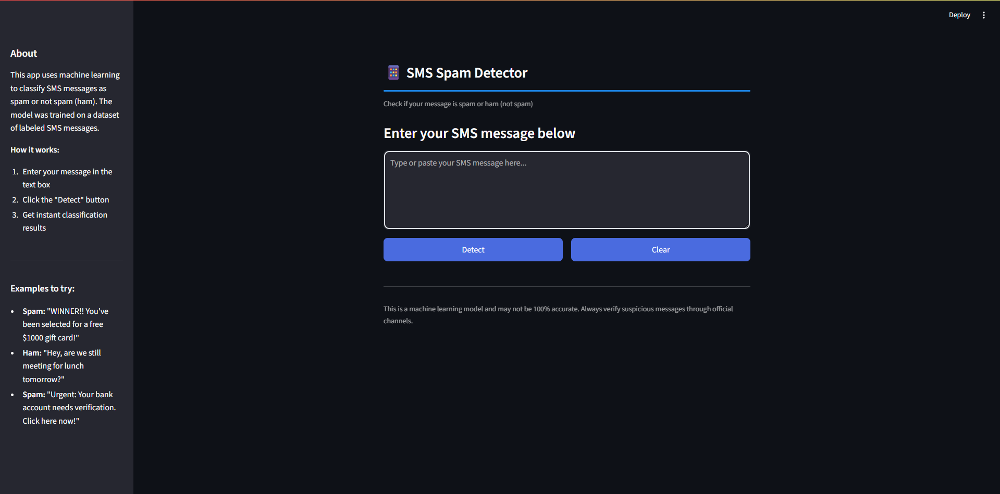

# 📱 SMS Spam Detector

A simple web app to detect spam messages using a machine learning model.



## ✨ Features

- Clean, modern interface with responsive design
- Real-time spam detection
- Confidence percentage display
- Example messages in sidebar

## 🚀 How to Run

```bash
git clone https://github.com/bhax1/spam-detector.git
cd spam-detector
pip install -r requirements.txt
streamlit run app.py (if streamlit is not recognized try this: python -m streamlit run app.py)

## Try it out!
https://bhax1-spam-detector-app-pykqvs.streamlit.app/